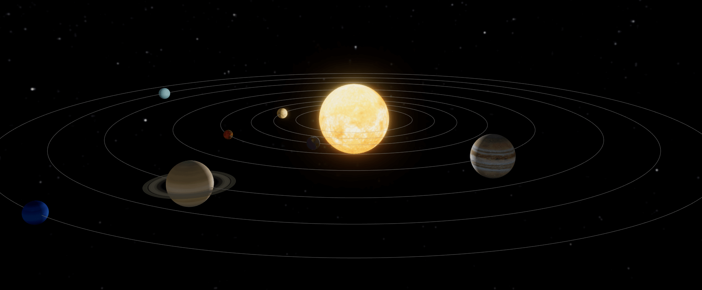

# Solar System 3D

developing ~~~

A 3D solar system based on webgl. Dedicated to my son Yifan :family:. 

## TODO

- [x] Sun And Plants
- [x] Planetary Rotation
- [] Loading
- [] Moon
- [] Asteroid Belt
- [] Kuiper Belt
- [] Camera Focus
- [] Information Panel
- [] Planetary Atmosphere

## Thanks for sharing textures

https://www.solarsystemscope.com/textures/